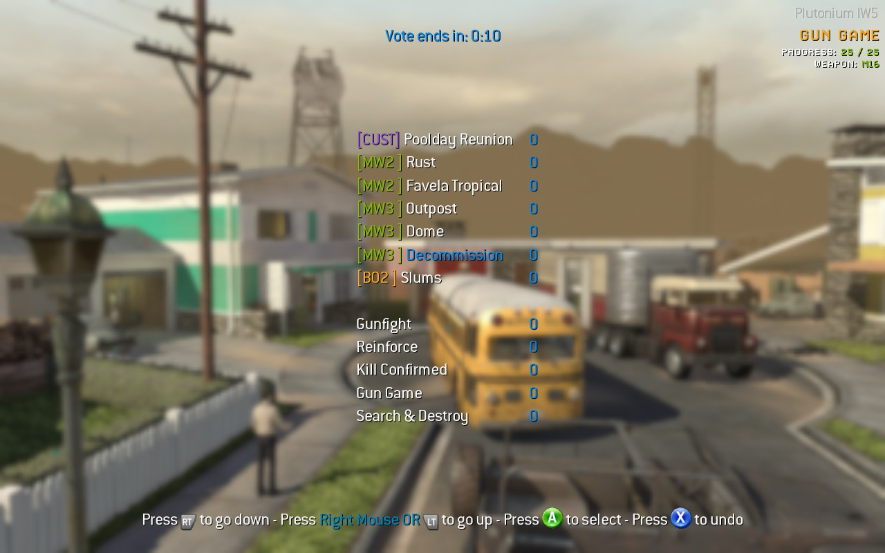
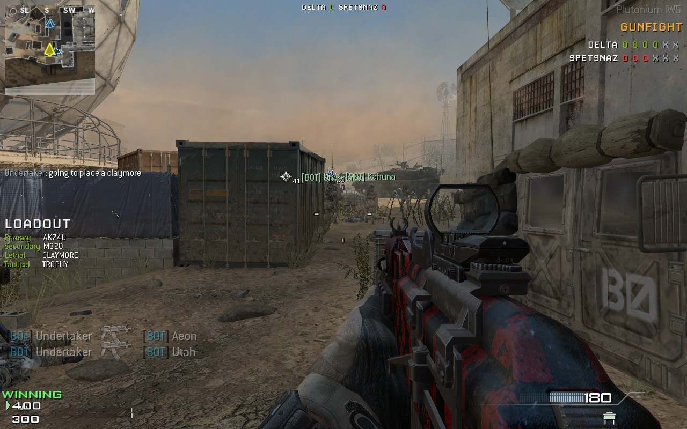
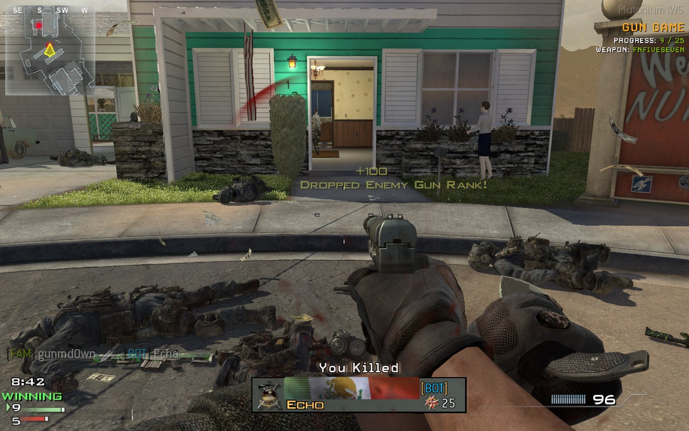
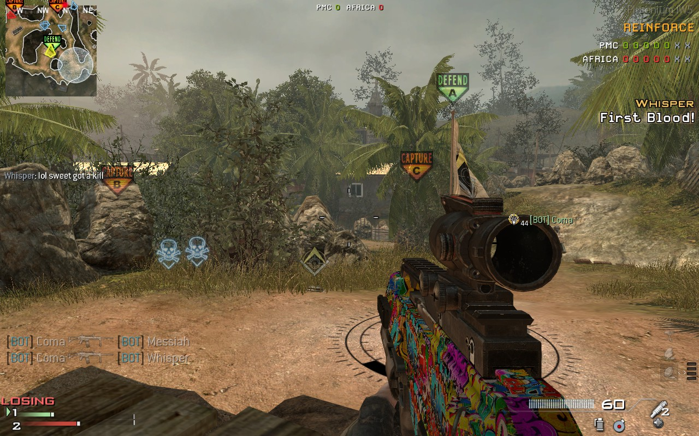

# Scripts

This is a collection of various scripts I have created for my own personal use. You are welcome to use any of these however you would like to create your own scripts, game modes, etc... For details on how to use each script and what they do, read the applicable section below.

If you find any issues, feel free to log an issue here in GitHub. I cannot promise to get to everything but I will try. Please keep in mind, I have created these for fun and primarily for personal use, so I may or may not be willing to make certain changes outside of bug fixes.

## Utility

The `bb_utility.gsc` script is a collection of common utility methods shared by many of my other scripts. It is a requirement for almost all of my scripts to work. Be sure to download this file and place it in your scripts directory before trying to use any other scripts you find here.

Most of the methods have comments on what they do and ones that I have copied or heavily adapted from other creators I have added attribution and links to the original code. Many thanks to the awesome Plutonium community members that have posted their own scripts and tutorials to help others (like me).

## Auto Bots

This script uses the map sizing table from the utility script to try and automatically populate matches with bots based on the size of the map being played and the game mode. I will likely make adjustments over time as I playthrough all the maps again and again to get the best sizing (IMO), so some of the sizing may be a bit off at the moment. The script will also attempt to automatically balance teams so that when human players join, bots are kicked until teams are evened back out.

The math I used to adjust for game modes works such that if a map's teambased size is 12 players, the non-teambased size would be 7. The logic behind this is that when playing 12 players (6v6) you have 6 enemies on the map. So in non-teambased, 7 players keeps that 6 enemy number which seems to work out very well. So the number is always half of the teambased value plus one.

## Friend Markers

This is an early prototype and will likely see changes and improvements. My goal for this script was to make it easier to spot my friends in matches when playing with bots. Currently, this simply sets the headicon of all friendly human players to their faction logo. This works well at short distances for spotting human friendlies. Ultimately, I want to replicate how some of the newer CoD titles display party members on the minimap in a different color, but that has so far proved to be a difficult thing to do.

## Settings

The `bb_settings.gcs` file is my personal set up for how I run other scripts I use (like the mapvote script I use) and my custom game modes. It likely would need tweaking for others' setups, unless you have the same scripts and maps as me.

I currently use the mapvote script created by Resxt that can be found here: https://github.com/Resxt/Plutonium-IW5-Scripts . Big time props to Resxt for the awesome script. I have also created a replacement method in my settings for the map rotation in the original script so that it can support my custom game modes as well. If you are interested in using those, I highly recommend this setup. See an image below for what mine currently looks like.

## Game Modes

The following are game modes I've tried to port from other Call of Duty titles into Modern Warfare 3. For the most part, I've tried to remain faithful to their official implementations, but in some cases, due to either engine differences or personal preference, I have deviated some. I've also implemented these game modes in a way where you can install them all at once and activate them by setting the `custom_game_mode` dvar in the console. This makes it possible to add all of these game modes at once and put them into a map/mode rotation script. If you would like these game modes to be implemented in a map rotation, check out how I set that up in my `bb_settings.gcs` script using Resxt's excellent map rotation script.

### Gunfight

Gunfight is a teambased game mode where all players are given an identical, randomized loadout. Players have a single life per round and health regen is disabled. Teams have 40 seconds (by default) to eliminate the enemy players. At 40 seconds, if no team is eliminated, an overtime flag is spawned on the map and the first team to capture it (or eliminate the other team) wins. If no one captures the overtime flag in 20 seconds, the team with the most health remaining wins the round. Play continues until 1 team has won 6 rounds total.

**Usage:**
1. Add the `bb_utility.gcs` script and the `gamemode_gunfight.gcs` script to your `%APPDATA%/Local/Plutonium/storage/iw5/scripts` directory.
2. Open the console using tilde and type `set custom_game_mode gunfight`.
3. Start a private match and select Headquarters as your game mode.
  * _Optionally, you can use Team Deathmatch as the game mode, but there will be no overtime flag._
4. Start the game and enjoy. If everything works, you should see the custom game mode name "GUNFIGHT" in the top right of your HUD.

**Features:**
- Fully randomized load outs, including perks and equipment.
- If Overkill is selected as a perk, the randomized secondary becomes a primary (so you get two primaries).
- Overtime flag is supported if you use headquarters as the base for the game mode. When using team deathmatch everything works, but there is no overtime flag.
- Tactical insertion works. If you have a tac insert placed and are killed, you will be respawned. The second respawn will not give you another tac insert so this is a one time respawn.
- Loadouts are used for two rounds, then re-randomized. You can adjust this via a DVAR if you want random loadouts every round or every 3rd round, etc...
- Team spawn points swap every round.
- Team life trackers displayed in the HUD to show how many players are still alive on both teams.
- Custom HUD elements display the current loadout each round.
- Round status (wins/losses) shown at the top of the HUD.
- Bots are fully supported and work great.

**Differences:**
- Grenades are not blocked for the first 5 seconds like in other titles. I probably could do this, but I don't feel it is necessary.
- Typically gunfight only works on smaller maps, but in this version you can play on any map you want. In my opinion, this is how the other CoDs should have been to begin with. This mode is fun, even on bigger maps.

**Known Issues:**
- When using Headquarters, spawns are a little funky in that players start slightly up in the air. This doesn't really affect anything and is a result of using the Team Deathmatch spawn system in Headquarters to ensure players always spawn with their team at the beginning of each round. I may try to fix this at some point, but it is a low priority.

### Gun Game

While Gun Game does exist in the base game, its implementation is pretty lacking. This is my custom version which is based on some newer titles, with some fun extras thrown in for variety.

I do want to give a specific shout out to Resxt who's custom gun game script really helped me learn the scripting for game modes and made this particular implementation possible. A chunk of the gun randomizing code is from their custom implementation found here: https://github.com/Resxt/Plutonium-IW5-Scripts/blob/main/gamemodes/gun_game.gsc

**Usage:**
1. Add the `bb_utility.gcs` script and the `gamemode_gun_game.gcs` script to your `%APPDATA%/Local/Plutonium/storage/iw5/scripts` directory.
2. Open the console using tilde and type `set custom_game_mode gungame`.
3. Start a private match and select Free For All as your game mode.
4. Start the game and enjoy. If everything works, you should see the custom game mode name "GUN GAME" in the top right of your HUD.

**Features:**
- Fully randomized guns with support to customize how many guns are required for a win. The default is 25 and the max is set to 50 since there are only ~50 total guns currently in the game.
- Custom HUD elements display the current gun you are using as well as your progress.
- Scores appropriately show your current level and the level of the highest enemy player (in the enemy score bar).
- Melee kills and suicides set killed players back in rank. This can be disabled if you don't like this feature.
- Custom DVARs can be set up to ban specific weapons if you want. I ban the javalin, for example, since it only works well in some maps.
- Underbarrel shotguns are supported and work appropriately to progress their attached gun.
- Guns automatically refill ammo on reload.
- Bots are fully supported.

**Differences:**
- Nothing major, this is pretty faithful to the real implementations with more randomness in weapon creation (compared to some titles).

**Known Issues:**
- Equipment (lethal) is half supported. Currently it is disabled due to needing some fixes. I may come back and fix this so nades and throwing knifes can be used, but bots also struggle to get kills with those items so I may not.

### Reinforce

Reinfroce is a game mode that is somewhat of a mix between Domination and elimination. Teams are trying to win by either eliminating the enemy team or capturing all three zones at once. Players do not respawn when they die and are instead only respawned after their team manages to capture a zone.

**Usage:**
1. Add the `bb_utility.gcs` script and the `gamemode_reinforce.gcs` script to your `%APPDATA%/Local/Plutonium/storage/iw5/scripts` directory.
2. Open the console using tilde and type `set custom_game_mode reinforce`.
3. Start a private match and select Domination as your game mode.
4. Start the game and enjoy. If everything works, you should see the custom game mode name "GUN GAME" in the top right of your HUD.

**Features:**
- Fully functional implementation of reinforce that plays almost exactly like the official mode.
- Custom HUD elements to display the number of wins per team and players still alive on each team.
- Bots are fully supported.

**Differences:**
- Nothing major, this is pretty complete.

**Known Issues:**
- None currently.

### Hardpoint

Coming soon? This is very much a work in progress that I may or may not finish someday.
